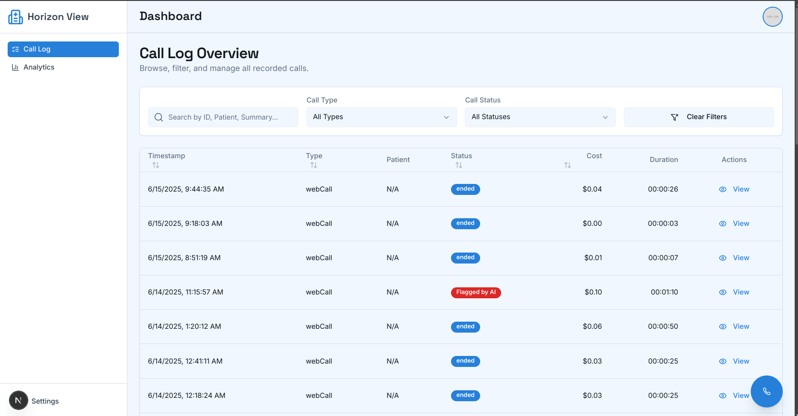

# Horizon Hospital Voice AI Agent customer Support

A modern web application for Horizon Hospital featuring a voice AI agent customer support system with visualization dashboard.

# Screenshots
 ### Login Page
 
 ### Home page
 
 ### Call Logs dashboard
 
 ### Analytics Dashboard
 
 ### Voice Agent
 
 ### Call Details
 

## Overview

Horizon Hospital is a Next.js application that provides:
- Public-facing hospital website with department information
- Interactive voice agent support for patient inquiries
- Admin dashboard for call analytics and management
- AI-powered call analysis and risk assessment

## Tech Stack

- **Framework**: Next.js 15.3.3 with React 18
- **Styling**: Tailwind CSS with shadcn/ui components
- **AI Integration**: GenKit with Google AI (Gemini 2.0 Flash)
- **Voice Integration**: Vapi.ai
- **Authentication**: Firebase Authentication
- **Database**: Firebase Firestore
- **Storage**: Firebase Storage

## Getting Started

### Prerequisites

- Node.js (LTS version recommended)
- npm or yarn or bun

### Installation

1. Clone the repository
```bash
git clone https://github.com/herberthk/horizon-hospital.git
cd horizon-hospital
```

2. Install dependencies
```bash
npm install
# or
yarn install
# or
bun install
```

3. Set up environment variables
Create a `.env.local` file in the root directory with the following variables:
```
# Firebase
NEXT_PUBLIC_FIREBASE_API_KEY=
NEXT_PUBLIC_FIREBASE_AUTH_DOMAIN=
NEXT_PUBLIC_FIREBASE_PROJECT_ID=
NEXT_PUBLIC_FIREBASE_STORAGE_BUCKET=
NEXT_PUBLIC_FIREBASE_MESSAGING_SENDER_ID=
NEXT_PUBLIC_FIREBASE_APP_ID=
FIREBASE_PROJECT_ID=
FIREBASE_CLIENT_EMAIL=
FIREBASE_PRIVATE_KEY=

# Gemini API Key (https://console.cloud.google.com/)
GOOGLE_GENERATIVE_AI_API_KEY=

# Vapi.ai
NEXT_PUBLIC_VAPI_API_KEY=
VAPI_PRIVATE_KEY=
```

### Development

Run the development server:
```bash
npm run dev
# or
yarn dev
# or
bun run dev
```

Open [http://localhost:9002](http://localhost:9002) in your browser.

## Project Structure

- `/src/app` - Next.js app router pages
- `/src/components` - Reusable React components
  - `/ui` - shadcn/ui components
  - `/landing` - Components for the public website
  - `/dashboard` - Components for the admin dashboard
  - `/shared` - Shared components used across the application
- `/src/lib` - Utility functions and shared logic
- `/src/ai` - AI integration with GenKit
- `/public` - Static assets

## Features

### Public Website
- Homepage with hospital information
- Department directory with detailed pages
- Appointment booking system
- Interactive voice agent customer support

### Dashboard
- Call log with detailed call information
- Call analytics and visualizations
- AI-powered call analysis and risk assessment
- Audio recordings and transcripts

## Deployment

Build the application for production:
```bash
npm run build
# or
yarn build
# or
bun run build
```

Start the production server:
```bash
npm start
# or
yarn start
# or
bun run start
```

## Contributing

1. Fork the repository
2. Create your feature branch (`git checkout -b feature/amazing-feature`)
3. Commit your changes (`git commit -m 'Add some amazing feature'`)
4. Push to the branch (`git push origin feature/amazing-feature`)
5. Open a Pull Request

## License

This project is licensed under the MIT License - see the LICENSE file for details.

